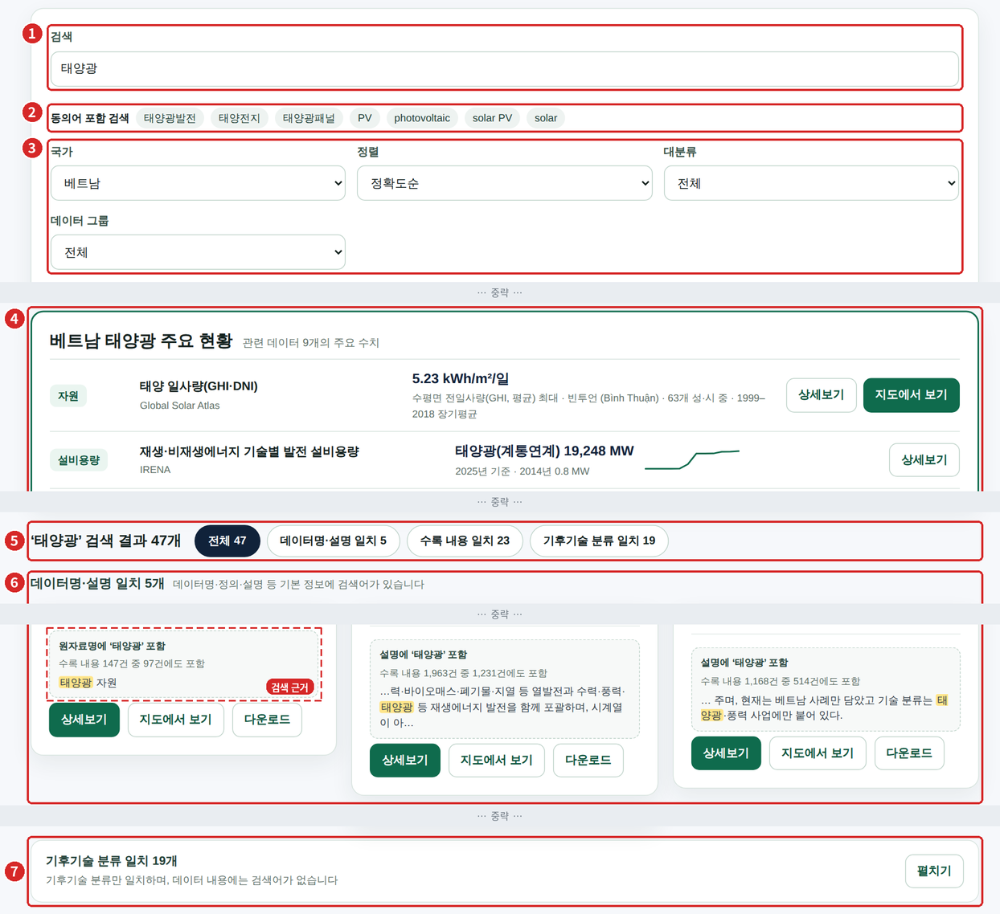
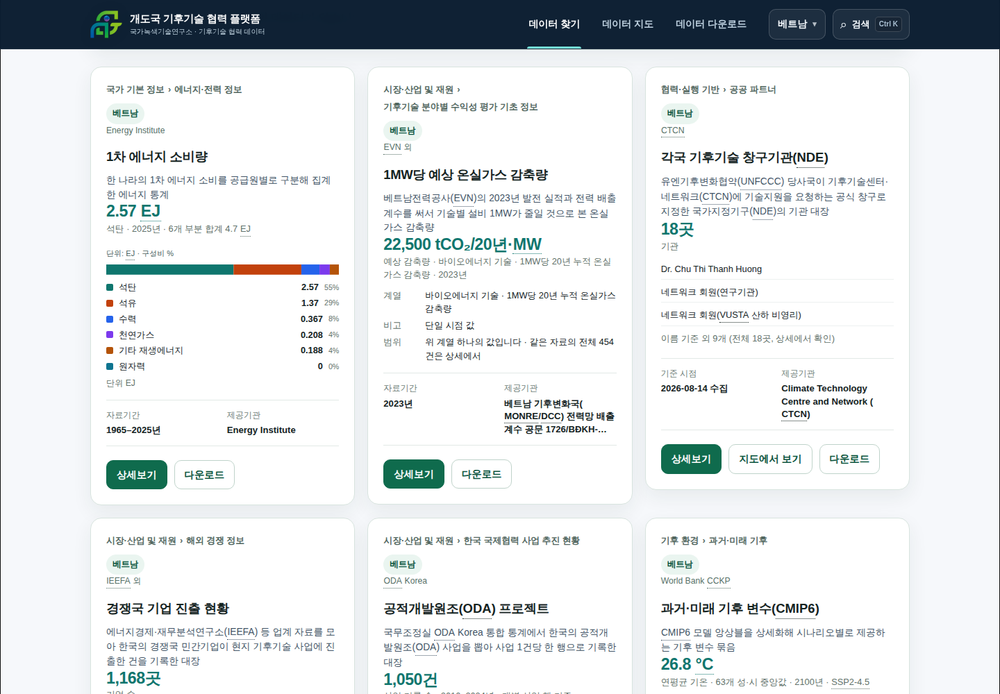
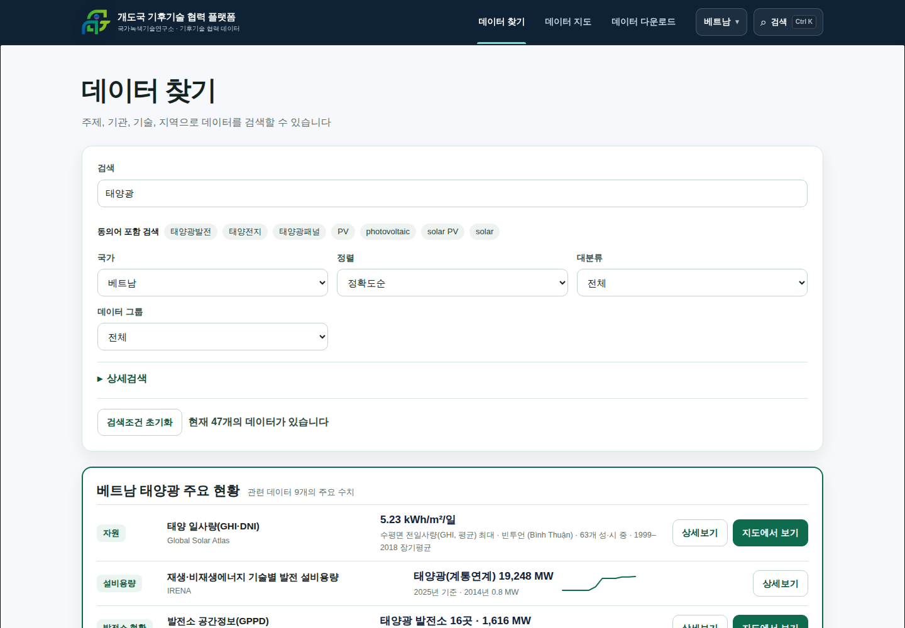
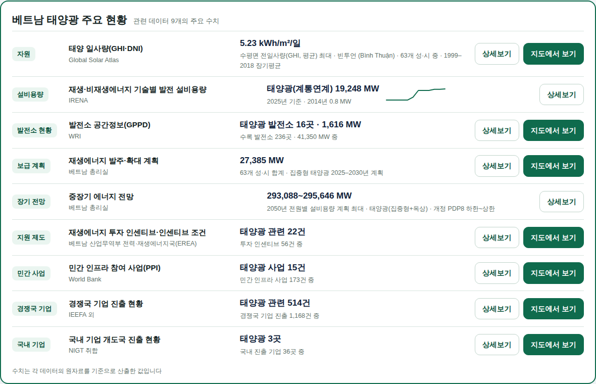
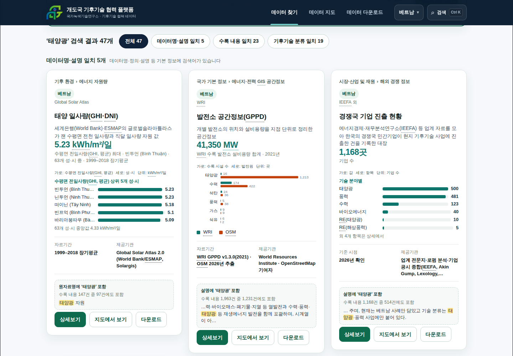

# 데이터 찾기 검색 기능 개선 기준

2026\. 10\. 7\. 국가녹색기술연구소 글로벌전략센터

## 1. 개요

- 목적: '데이터 찾기' 검색 결과의 정확도와 이해도를 높이기 위해 화면 구성, 검색 규칙, 검수 기준을 정함
- 개선 사항: 주요 현황(3-가), 정확도순 정렬 및 결과 구분(3-나), 검색 근거(3-다), 동의어 포함 검색(3-라)
- 추진 단계: 1단계 화면 기능 반영 및 검색 결과용 파일 생성(귀사), 2단계(1단계 완료 후 용역 종료 전까지, 검수·인계 포함) 데이터 갱신 시 자동 생성·검색사전 관리 기능(4장)

## 2. 화면 구성(위에서 아래 순)

| 순서 | 영역 | 관련 규칙 | 표시 조건 |
|---|---|---|---|
| 1 | 검색창 | - | 상시 |
| 2 | 동의어 포함 검색 | 3-라 | 검색어가 동의어 사전에 등록된 경우 |
| 3 | 필터·정렬 | 3-나 | 상시('정확도순' 정렬 추가) |
| 4 | 주요 현황 | 3-가 | 국가 1개 선택, 주제어 검색, 그 밖의 필터 미선택 시 |
| 5 | 결과 구분 버튼 | 3-나 | 검색어 입력 시 |
| 6 | 구분 제목·데이터 카드(검색 근거 포함) | 3-나, 3-다 | 검색어 입력 시 |
| 7 | '기후기술 분류 일치' 접힘 막대 | 3-나 | 정확도순 '전체' 보기에서 해당 결과가 있는 경우 |

- 검색어 미입력 시 목록·정렬(가나다순 기본)·카드는 현행 유지

*그림 1. 화면 구성(베트남, '태양광' 검색, 1440px). 번호는 위 표의 순서이며, 점선은 카드 하단 검색 근거임(일부 구간 생략)*

## 3. 기능 규칙

### 가. 주요 현황

- 표시 조건: 국가 1개 선택, 검색어가 주제 사전(10개 주제)에 해당, 그 밖의 필터(대분류·데이터 그룹·기관·기술·연도·제공 형태·사용자·유형)가 모두 '전체'인 경우
- 제목: '{국가명} {주제} 주요 현황', 부제: '관련 데이터 {N}개의 주요 수치'
- 행 구성: 항목 | 데이터명·제공기관 | 수치·보조 문구(3개 연도 이상은 추이 그래프 포함) | 상세보기·지도에서 보기
- 수치는 원자료로 산출한 값을 그대로 표시하며, 추정하거나 보정하지 않음(산출 방식은 4장 참조)
- 산출 방식(4종)
  - 대표값: 대표값 문구에 조건어가 있는 경우에만 사용
  - 지표 최신값: 지표 1개의 최신 연도 값(여러 지표 합산 금지)
  - 시설 집계: 주연료가 주제어인 시설의 수·용량 합계(예: 태양광 발전소 16곳 · 1,616 MW)
  - 수록 내용 건수: 주제어(동의어 포함)가 들어간 수록 내용 건수(예: 태양광 관련 22건 / 투자 인센티브 56건 중)
- 값이 없는 행은 표시하지 않으며, 3행 미만인 주제는 주요 현황 전체를 표시하지 않음. 추정값·임의값으로 채우지 않음
- 지역명은 기존 표기 규칙('한글(현지명)')을 따름
- 하단 주석: '수치는 각 데이터의 원자료를 기준으로 산출한 값입니다'

### 나. 정확도순 정렬 및 결과 구분

- 검색어 입력 시 정렬 기본값은 '정확도순'(정렬 목록 첫 항목)이며, 검색어 미입력 시 '정확도순'은 선택할 수 없음
- '가나다순'·'조회순' 선택 시 해당 순서로 정렬하되, 결과 구분 버튼은 유지함
- 결과 구분 기준(데이터별)

| 구분 | 판정 기준 | 화면 설명 문구 |
|---|---|---|
| 데이터명·설명 일치 | 데이터명·원자료명·정의·설명·활용 방법·분류·제공기관·국가에 검색어가 있음 | 데이터명·정의·설명 등 기본 정보에 검색어가 있습니다 |
| 수록 내용 일치 | 위 항목에는 없고, 데이터에 수록된 개별 내용(원자료의 행)에만 있음 | 데이터에 수록된 내용 일부에 검색어가 있습니다(포함 비율이 높은 순) |
| 기후기술 분류 일치 | 기후기술 분류명에만 있음 | 기후기술 분류만 일치하며, 데이터 내용에는 검색어가 없습니다 |

- 검색어가 여러 단어인 경우 모든 단어가 있어야 결과에 포함하며(AND 조건), 구분은 가장 낮은 단계로 일치한 단어를 기준으로 함
- 제공기관·국가는 입력한 단어로만 비교함(동의어 미적용). 예: '태양광' 검색 시 제공기관 'Global Solar Atlas'는 일치로 보지 않음
- 구분 내 순서: 아래 점수가 높은 순, 동점은 가나다순. '데이터 준비 중' 데이터는 구분 내 마지막에 배치

| 일치 위치 | 점수 |
|---|---|
| 데이터명 | 1,000 + 400 + 수록 내용 일치 비율 × 100 |
| 원자료명 | 1,000 + 380 + 비율 × 100 |
| 정의 | 1,000 + 300 + 비율 × 100 |
| 설명 | 1,000 + 260(데이터 목록) 또는 250(데이터 명세서) + 비율 × 100 |
| 활용 방법 | 1,000 + 200 + 비율 × 100 |
| 분류 / 제공기관 / 국가 | 1,000 + 150 / 120 / 50 + 비율 × 100 |
| 수록 내용에만 있음 | 500 + 비율 × 400 + log₁₀(일치 건수 + 1) × 20(최대 50) |
| 기후기술 분류명에만 있음 | 100 |

- 결과 머리말·버튼: '‘{검색어}’ 검색 결과 {N}개' 옆에 전체 / 데이터명·설명 일치 / 수록 내용 일치 / 기후기술 분류 일치 버튼(각 건수 표시)을 둠. 0건인 구분은 선택할 수 없음
- 정확도순 '전체' 보기에서는 구분마다 제목('{구분명} {N}개')과 설명 문구 1줄을 표시함
- '기후기술 분류 일치'는 접힌 상태로 표시하고 '펼치기' 버튼으로 열며, 펼친 후에는 '접기' 버튼을 제공함

### 다. 검색 근거(데이터 카드 하단, 버튼 위)

- 1행
  - 데이터명·설명 일치: '{일치 위치}에 ‘{검색어}’ 포함'(예: 설명에 ‘태양광’ 포함). 수록 내용에도 있는 경우 '수록 내용 N건 중 M건에도 포함'을 덧붙임
  - 수록 내용 일치: '수록 내용 N건 중 M건에 ‘{검색어}’ 포함'
- 2행: 첫 일치 문구의 앞뒤 28자를 표시하고 검색어를 강조(노란 배경)함. 데이터명에서 일치한 경우 카드 제목과 중복되므로 생략함
- 기후기술 분류 일치: 1·2행 대신 '기후기술 분류에만 ‘{검색어}’ 관련 기술이 있으며, 데이터 내용에는 검색어가 없습니다'를 표시함
- 2행 문구는 공개용 정제 규칙(참조 코드 `build-search-v170.mjs`의 제외 규칙)을 적용한 원자료 문구에서만 가져오며, 내부 키·코드·파일명·링크·이메일·작업 메모·빈값 표기('미확인' 등)는 표시하지 않음

### 라. 동의어 포함 검색

- 검색창 아래 '동의어 포함 검색' 줄에 함께 검색한 동의어를 표시함
- 동의어 사전: `src/data/search/searchSynonymsV170.json`(46개 그룹: 기후기술 32개, 기후위험·탄소시장·정책·재원 등 14개)
- 적용 규칙
  - 같은 그룹의 단어는 같은 뜻으로 보고 양방향으로 함께 검색함
  - 상위·하위 개념은 포함하지 않음(예: 재생에너지 ⊃ 태양광)
  - 한글은 단어 내부까지 검색하고 띄어쓰기를 무시함(태양광 발전 = 태양광발전)
  - 영문·약어는 단어 단위로만 검색하며(PV로 PVC를 찾지 않음), 대소문자를 구분하지 않음
  - 사전에 등록된 띄어 쓴 단어('solar PV', '해수면 상승')는 한 단어로 처리함

## 4. 구현 방식 및 추진 단계

- 구현 방식(화면에서 처리 또는 서버 API로 제공 등)은 귀사 시스템 구조에 맞게 정함
- 구현 방식과 관계없이 결과 구분·점수·동의어 적용·문구 정제 규칙(3장)과 주요 현황 산출 방식(3-가)을 참조 코드와 동일하게 적용하고, 같은 데이터 기준으로 참조 코드와 같은 결과(구분별 건수, 주요 현황 수치, 수록 내용 건수)가 나올 것

### 가. 1단계: 화면 기능 반영 및 검색 결과용 파일 생성

- 3장의 화면 기능 4종(주요 현황, 정확도순 정렬 및 결과 구분, 검색 근거, 동의어 포함 검색)을 반영함
- 화면에 필요한 검색 결과용 파일은 귀사가 데이터 수집 용역사의 NAS에서 데이터를 가져와 직접 생성함(용역 종료 후에는 연구소가 보유한 데이터 기준)
  - `topics-<ISO3>.json`: 국가별 주요 현황 행(항목·데이터 ID·수치·보조 문구·추이)
  - `records-<ISO3>.json`: 데이터별 수록 내용 문구(공개용 정제 완료)와 건수. 수록 내용 일치 판정과 검색 근거 2행에 사용
- 붙임 4는 연구소가 같은 방식으로 생성한 예시(베트남·방글라데시, 연구소 플랫폼 데이터 2026. 10. 7. 기준)이며, 파일 형식과 기대 결과의 기준임
- 생성 방식은 참조 코드 `build-search-v170.mjs`와 `topic-rules-v170.json`을 따르며, 데이터를 읽는 부분만 귀사 데이터 구조에 맞게 수정함
- 결과 구분·점수·동의어 적용 로직은 참조 코드 `searchMatchV170.ts`(외부 라이브러리 없는 TypeScript)를 그대로 이식하여 사용할 수 있음
- 생성 기능이 완성되기 전 화면 확인에는 붙임 4를 사용할 수 있음
- 국가별 파일은 같은 형식이므로, 화면은 국가 수와 관계없이 파일만 추가하면 동작하도록 구현함(국가별 코드 분기 금지). 화면은 검색 결과를 한 곳(파일 경로 또는 API)에서 읽도록 함
- 대용량 공간자료(예: A-026 건물 윤곽)는 개별 피처(건물 1동 등)를 수록 내용으로 색인하지 않고, 참조 코드와 같이 요약 항목(피처 수·면적·용도별 건수 등)만 수록 내용으로 사용함

### 나. 2단계(1단계 완료 후 용역 종료 전까지, 검수·인계 포함): 자동 생성·관리 기능

- 데이터 추가·값 갱신, 국가 추가(방글라데시 갱신분, 그 밖의 8개국 포함) 시 검색 결과용 파일이 수작업 없이 다시 생성되도록 구성함
- 주요 현황 규칙은 데이터 ID 기준으로 모든 국가에 공통 적용되므로, 국가 추가 시 코드 수정 없이 해당 국가의 결과가 생성되도록 함
- 동의어 사전·주요 현황 규칙(붙임 2)은 코드 수정 없이 변경할 수 있도록 구성함(관리자 화면 또는 파일 반영 절차)
- 용역 종료 후 연구소가 데이터·검색사전을 직접 갱신할 수 있도록 갱신 절차를 운영·유지관리 매뉴얼에 포함하여 인계함

### 다. 참고

- 새로 추가한 데이터를 주요 현황에 표시하려면 주요 현황 규칙에 항목을 추가해야 함(검색 결과·검색 근거에는 자동 반영)
- 국가별 데이터 수집이 완료되면 연구소가 해당 국가의 주요 현황을 확인하고, 필요 시 주요 현황 규칙을 보완함(값이 없는 항목은 자동으로 표시하지 않음)
- 참조 코드의 기존 전문 검색 색인(`search-index-v124`)은 작업 메모가 섞여 있어 공개 화면의 근거로 부적합하므로 '데이터 찾기' 검색에 사용하지 않음

### 라. 참조 코드 및 제공 파일

| 파일 | 내용 |
|---|---|
| `src/data/search/searchMatchV170.ts` | 결과 구분·점수·동의어 적용 규칙, 검색 근거 문구 |
| `scripts/v170/build-search-v170.mjs` | 수록 내용 문구 정제, 주요 현황 수치 산출(참조 코드는 정적 파일로 생성) |
| `scripts/v170/topic-rules-v170.json` | 주요 현황 규칙(10개 주제) |
| `src/data/search/searchSynonymsV170.json` | 동의어 사전(검색사전에서 변환) |
| `src/data/search/searchMatchV170.test.ts` | 규칙 확인용 단위 시험 |
| 붙임 4 `topics-VNM.json`·`topics-BGD.json`, `records-VNM.json`·`records-BGD.json` | 검색 결과용 파일 예시(연구소 생성, 형식·기대 결과 기준) |

## 5. 검수 기준

| 검색어(베트남) | 변경 전 | 변경 후 | 구분별 건수(데이터명·설명 / 수록 내용 / 기후기술 분류) | 주요 현황 |
|---|---|---|---|---|
| 태양광 | 50개(가나다순 나열) | 47개 | 5 / 23 / 19 | 9행 |
| 풍력 | 49개 | 47개 | 5 / 17 / 25 | 8행 |
| 홍수 | 8개 | 13개('침수'·'flood' 포함) | 2 / 11 / 0 | 5행 |

- 위 건수는 붙임 4 예시(연구소 플랫폼 데이터, 2026. 10. 7. 기준) 기준이며, 데이터가 달라지면 건수도 달라질 수 있음. 판정은 같은 데이터를 참조 코드와 귀사 시스템에 각각 적용한 결과의 일치 여부로 함
- 같은 데이터로 귀사가 생성한 검색 결과용 파일이 붙임 4 예시와 일치할 것(베트남 10개 주제·방글라데시 9개 주제의 주요 현황 행, 수록 내용 문구·건수)
- 국가별 파일을 추가하는 것만으로 해당 국가의 검색 결과·주요 현황이 표시될 것(코드 수정 없음)
- 2단계: 데이터 갱신·국가 추가 시 수작업 없이 검색 결과용 파일이 다시 생성되고 화면에 반영될 것
- 국가 '전체' 검색 시 주요 현황은 표시하지 않고, 결과 구분은 정상 표시할 것
- 검색 근거에 내부 코드·작업 메모·파일명이 없을 것(0건)
- 화면 폭 6종(320·390·768·1024·1440·1920px)에서 가로 넘침이 없을 것(0건)
- 주요 현황의 '관련 N건'과 검색 근거의 '수록 내용 N건 중 M건'이 같은 산출 방식으로 일치할 것(참조 코드 단위 시험 `searchMatchV170.test.ts` 참고)

## 6. 참조 화면(베트남, 1440px)

*그림 2. 변경 전: '태양광' 검색 결과(50개, 가나다순 나열)*

*그림 3. 변경 후 상단: 동의어 포함 검색, '정확도순' 정렬, 베트남 태양광 주요 현황*

*그림 4. 주요 현황(9행): 항목 · 데이터명·제공기관 · 수치·보조 문구 · 상세보기·지도에서 보기*

*그림 5. 결과 구분 버튼, 구분 제목, 카드 하단 검색 근거(예: 설명에 ‘태양광’ 포함, 노란 강조)*

*그림 6. 목록 하단 '기후기술 분류 일치' 접힘 막대와 '펼치기' 버튼*
